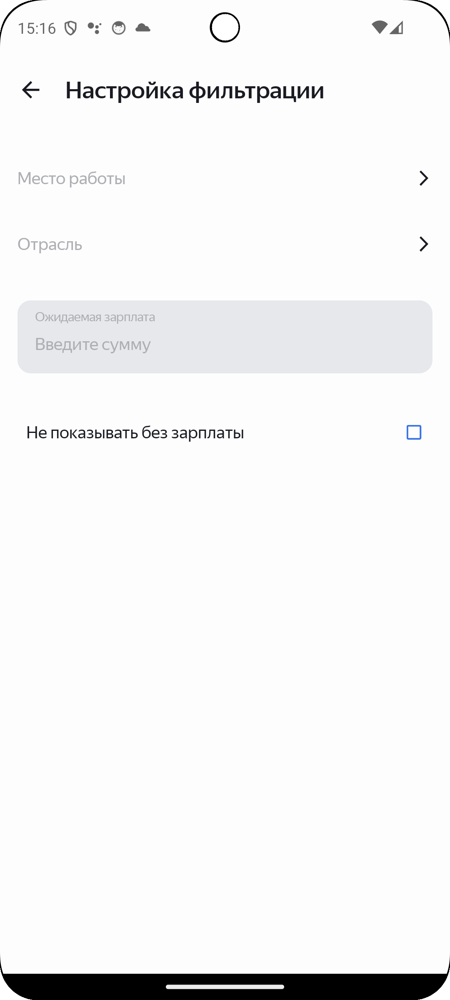
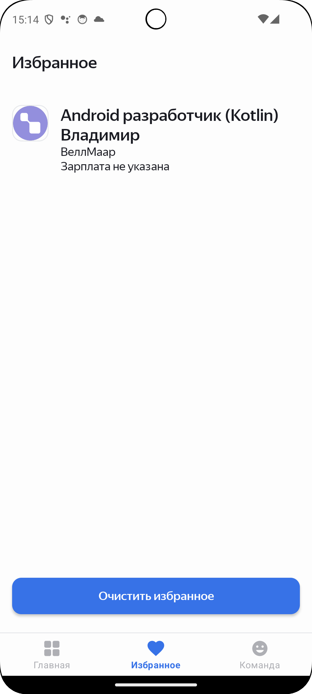
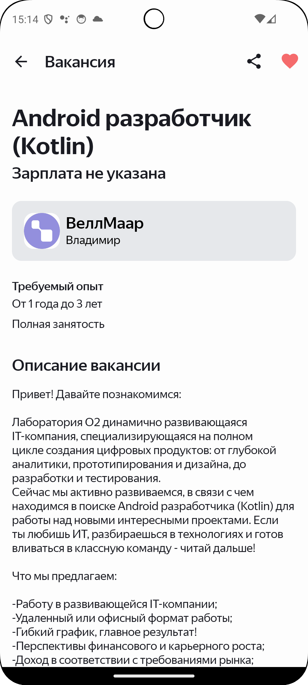

# 💼 HandHunter

**HandHunter** — это Android-приложение, позволяющее искать вакансии по API [HeadHunter](https://api.hh.ru/), использовать гибкие фильтры, сохранять избранные вакансии и быть в курсе интересных предложений работы.

---

## 🔍 Основной функционал

* 🧠 **Поиск вакансий** по ключевым словам и множеству фильтров (город, уровень зарплаты, тип занятости и др.)
* ⭐ **Избранное** — сохранение понравившихся вакансий
* 📄 Просмотр подробной информации по каждой вакансии
* 📂 **Фильтрация**: гибкий подбор по параметрам
* 🌙 Поддержка темной темы
* 📲 Удобная навигация между экранами с помощью Jetpack Navigation

---

## 🧠 Архитектура и технологии

Проект построен на принципах **Clean Architecture** с разделением на слои:

* **Data**: работа с HeadHunter API, Room (локальное хранилище)
* **Domain**: бизнес-логика, модели, use case'ы
* **Presentation**: `ViewModel`, `StateFlow`, UI-компоненты

**Технологический стек:**

* `Kotlin`
* `Coroutines` — асинхронная работа с API
* `StateFlow` — управление состоянием экрана
* `Room` — база данных для избранных вакансий
* `Jetpack Navigation` — навигация между экранами
* `ViewModel` — логика управления состоянием UI
* `Koin` — внедрение зависимостей

---

## 📲 Пользовательский флоу

1. **Поиск вакансий**
   Пользователь вводит ключевые слова и применяет фильтры (регион, зарплата, график и пр.), затем видит список релевантных вакансий.

2. **Просмотр вакансии**
   При выборе вакансии открывается подробное описание.

3. **Избранное**
   Понравившиеся вакансии можно сохранить — они доступны и после перезапуска приложения.

4. **Фильтры**
   Реализована система фильтров для гибкой настройки поиска — по городу, видимости зарплаты и другим параметрам.

---

## 🖼️ Скриншоты

| Поиск | Фильтры | Избранное | Подробности |
|------|---------|-----------|-------------|
|  |  |  |  |
> Скриншоты хранятся в папке `screenshots/`


## 🚀 Установка

1. Клонируй репозиторий:

   ```bash
   git clone https://github.com/твой-репозиторий/HandHunter.git
   ```

2. Открой проект в Android Studio.

3. Запусти приложение на эмуляторе или физическом устройстве.

---

